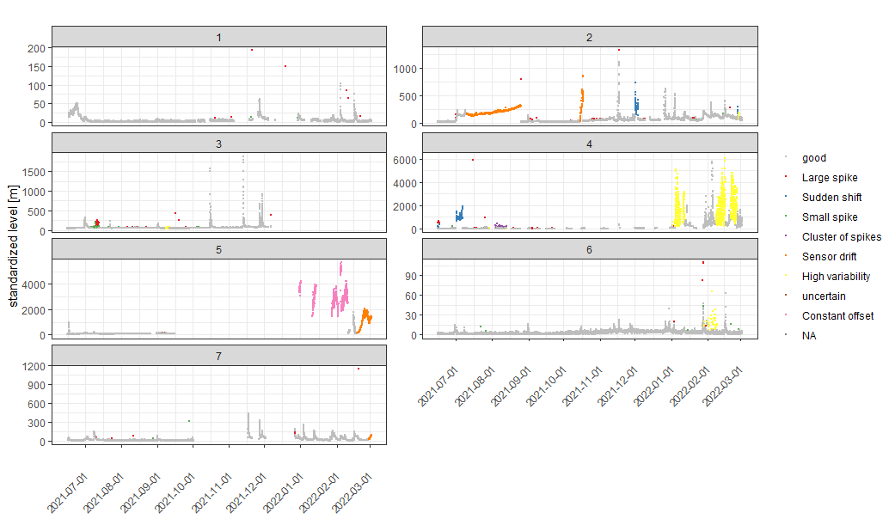
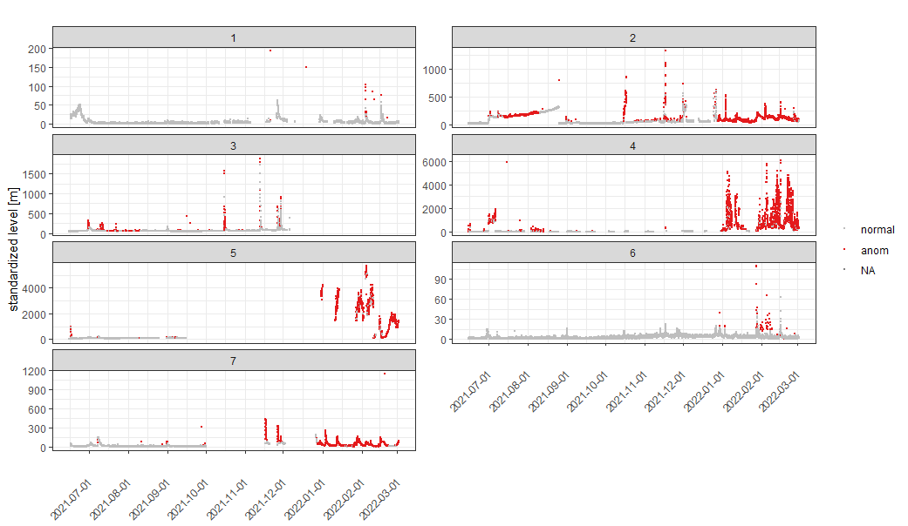
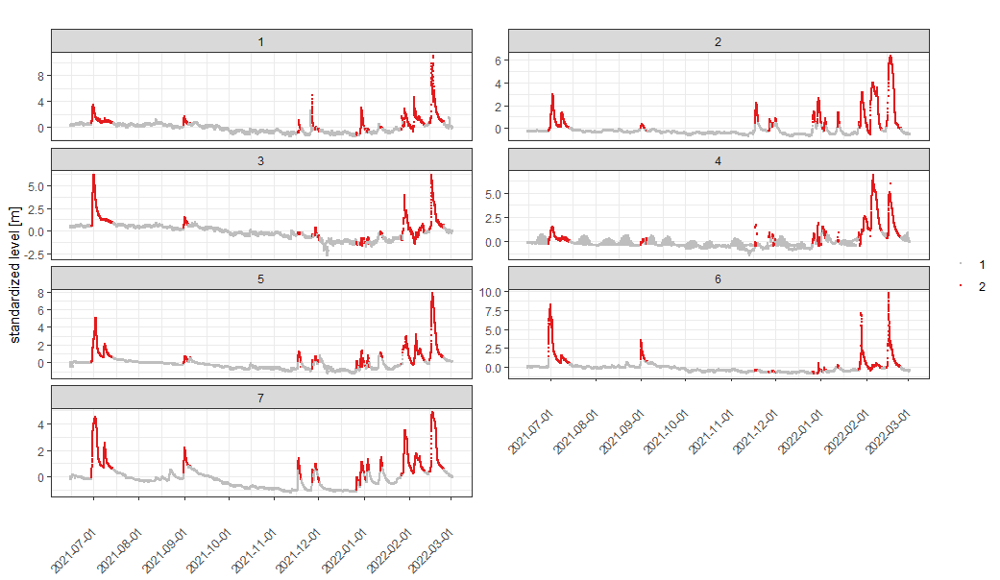

# herbert
<<<<<<< HEAD

<!-- badges: start -->
<!-- badges: end -->

herbert: This dataset contains water quality parameters from 7 sites in the Herbert River, located in Queensland, Australia, which flows into the Great Barrier Reef. It includes water level, precipitation, and total suspended solids (TSS), collected across different locations and times.

## Installation

You can install the development version of herbert from [GitHub](https://github.com/):


``` r
devtools::install_github("EdgarSantos-Fernandez/herbert")
```

See more details in the article:

@article{santos2024unsupervised,
  title={Unsupervised anomaly detection in spatio-temporal stream network sensor data},
  author={Santos-Fernandez, Edgar and Hoef, Jay M Ver and Peterson, Erin E and McGree, James and Villa, Cesar A and Leigh, Catherine and Turner, Ryan and Roberts, Cameron and Mengersen, Kerrie},
  journal={arXiv preprint arXiv:2409.07667},
  year={2024}
}

Santos-Fernandez, Edgar, Jay M. Ver Hoef, Erin E. Peterson, James McGree, Cesar A. Villa, Catherine Leigh, Ryan Turner, Cameron Roberts, and Kerrie Mengersen. "Unsupervised anomaly detection in spatio-temporal stream network sensor data." arXiv preprint arXiv:2409.07667 (2024).


# Example of one of the outputs produced


## Total Suspended Solids (TSS) anomalies (labels / ground truth)




# Total Suspended Solids (TSS) anomalies identified using the Bayesian spatio-temporal model




## Water level events (ambient vs event)




# References

<div id="refs" class="references csl-bib-body hanging-indent">

<div id="ref-ssnbayesArxiv" class="csl-entry">


Santos-Fernandez, Edgar, Jay M. Ver Hoef, Erin E. Peterson, James McGree, Cesar A. Villa, Catherine Leigh, Ryan Turner, Cameron Roberts, and Kerrie Mengersen. "Unsupervised anomaly detection in spatio-temporal stream network sensor data." arXiv preprint arXiv:2409.07667 (2024).

Santos-Fernandez, Edgar, Jay M. Ver Hoef, James M. McGree, Daniel J.
Isaak, Kerrie Mengersen, and Erin E. Peterson. 2022. “SSNbayes: An R
Package for Bayesian Spatio-Temporal Modelling on Stream Networks.”
arXiv. <https://doi.org/10.48550/ARXIV.2202.07166>.

</div>
=======
This dataset provides a comprehensive overview of water quality metrics from 7 sites in the Herbert River, located in Queensland, Australia, which flows into the Great Barrier Reef.
>>>>>>> aad4088afc86465463acd7c50f15b06916b9a432
